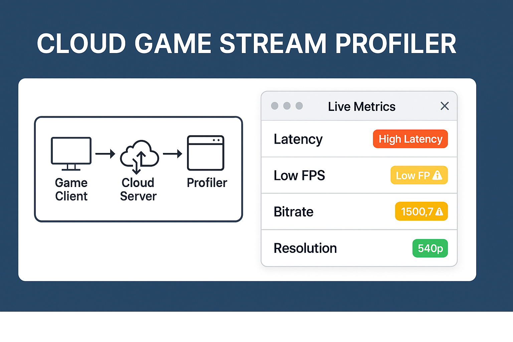
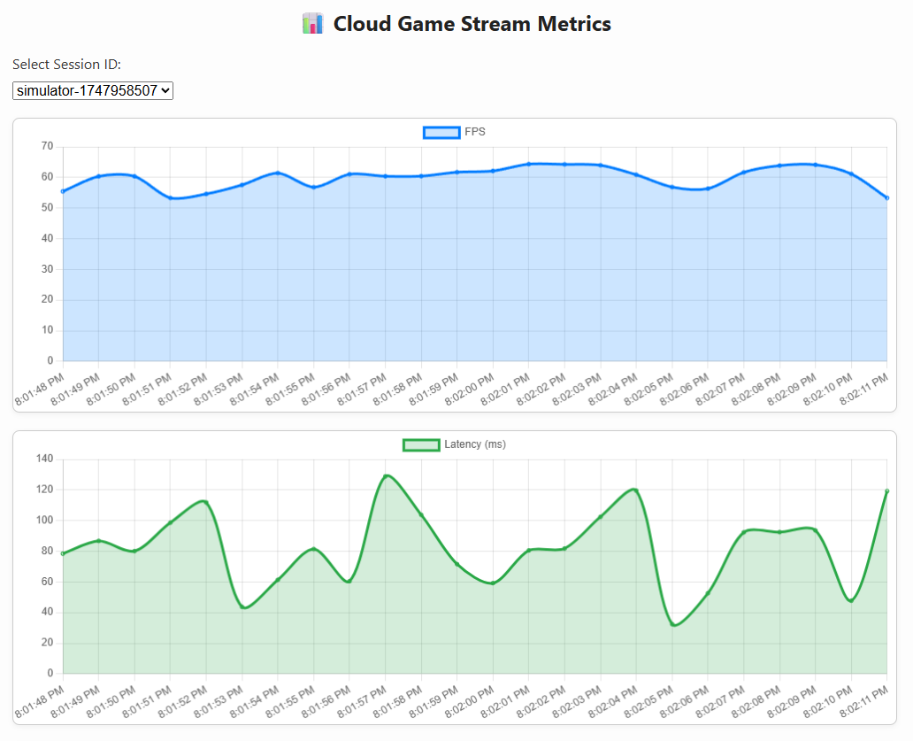
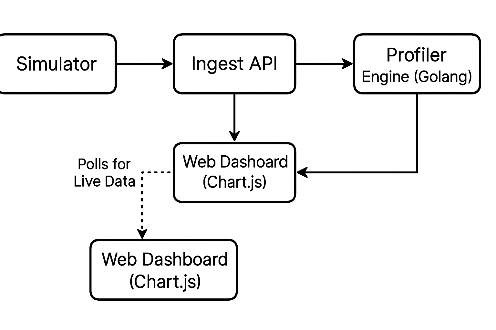
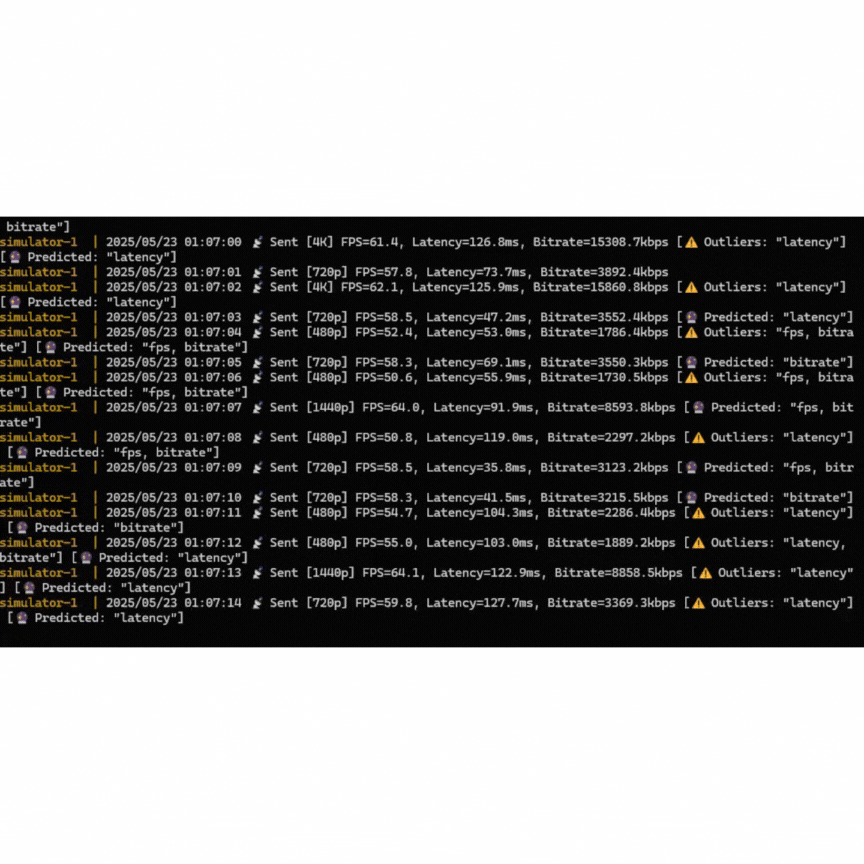

<p align="center">
  
</p>

# 🎮 Cloud Game Stream Profiler

A real-time observability dashboard for cloud gaming performance — built to mimic infrastructure challenges at Netflix Gaming.



### 🧩 System Architecture

This diagram illustrates how the simulator, profiler, and dashboard components interact in real time.



### 🎮 Live Profiler Demo

Watch the simulator generate FPS, Latency, and Bitrate metrics in real time, streamed to the cloud-based dashboard.




## 🚀 Features

- 📊 Real-time FPS / latency / bitrate monitoring
- 🔍 Outlier and anomaly detection
- 🎯 Adaptive resolution simulation (480p–4K)
- 🐳 Fully Dockerized (profiler + simulator)

## 🛠️ Tech Stack

- Go (Golang)
- Chart.js
- HTML/CSS
- Docker & Docker Compose

## 📦 Getting Started

```bash
git clone https://github.com/Sandcobra/cloud-game-stream-profiler.git
cd cloud-game-stream-profiler
docker compose up --build


 
